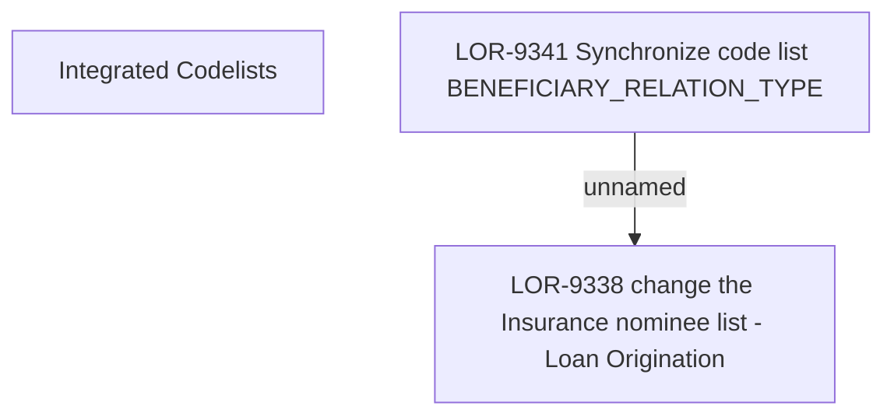

# LOR-9338 change the Insurance nominee list - Loan Origination

- **Diagram Type**: Custom
- **Package**: HomerSelect/BSL/Requirements Model/Finished/LOR/LOR-9338 change the Insurance nominee list - Loan Origination
- **Diagram ID**: 151248
- **Elements**: 3
- **Connectors**: 1

