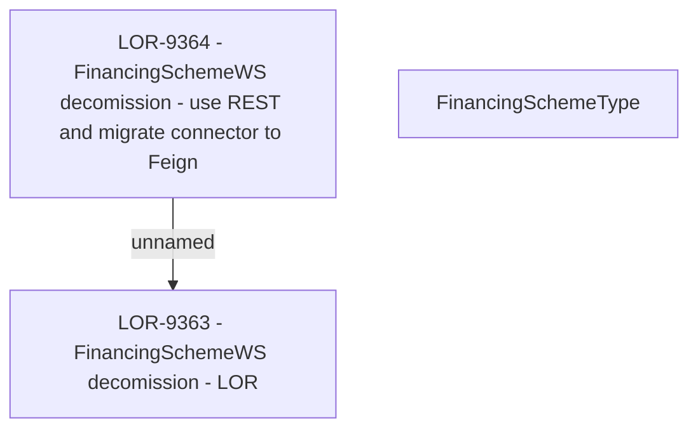

# LOR-9363 - FinancingSchemeWS decomission - LOR

```mermaid
graph TD
    LOR_9363_FinancingSchemeWS_decomission_LOR["LOR-9363 - FinancingSchemeWS decomission - LOR"]
    LOR_9364_FinancingSchemeWS_decomission_use_REST_and_migrate_["LOR-9364 - FinancingSchemeWS decomission - use REST and migrate connector to Feign"]
    FinancingSchemeType["FinancingSchemeType"]
    LOR_9364_FinancingSchemeWS_decomission_use_REST_and_migrate_ -->|unnamed| LOR_9363_FinancingSchemeWS_decomission_LOR
```
