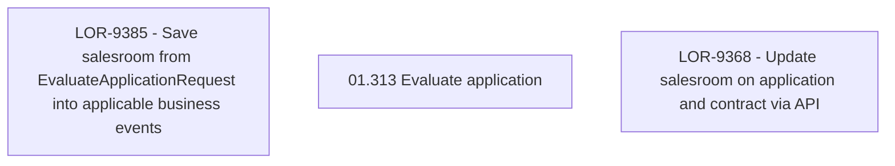

# LOR-9385 - Save salesroom from EvaluateApplicationRequest into applicable business events

- **Diagram Type**: Custom
- **Package**: HomerSelect/BSL/Requirements Model/Finished/LOR/LOR-9368 - Update salesroom on application and contract via API/LOR-9385 - Save salesroom from EvaluateApplicationRequest into applicable business events
- **Diagram ID**: 151713
- **Elements**: 3
- **Connectors**: 0

