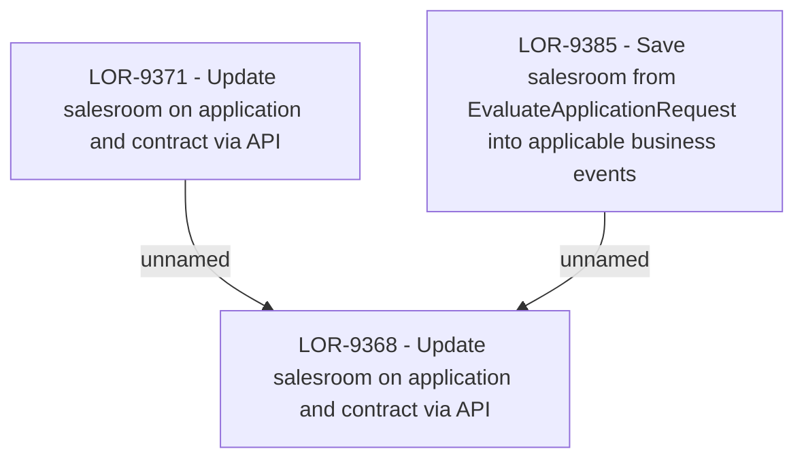

# LOR-9368 - Update salesroom on application and contract via API

- **Diagram Type**: Custom
- **Package**: HomerSelect/BSL/Requirements Model/Finished/LOR/LOR-9368 - Update salesroom on application and contract via API
- **Diagram ID**: 151711
- **Elements**: 3
- **Connectors**: 2

