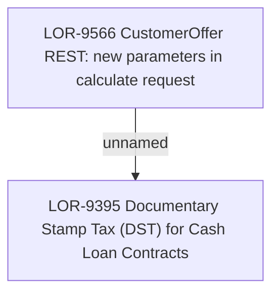

# LOR-9395 Documentary Stamp Tax (DST) for Cash Loan Contracts

- **Diagram Type**: Custom
- **Package**: HomerSelect/BSL/Requirements Model/Finished/LOR/LOR-9395 Documentary Stamp Tax (DST) for Cash Loan Contracts
- **Diagram ID**: 153112
- **Elements**: 2
- **Connectors**: 1

