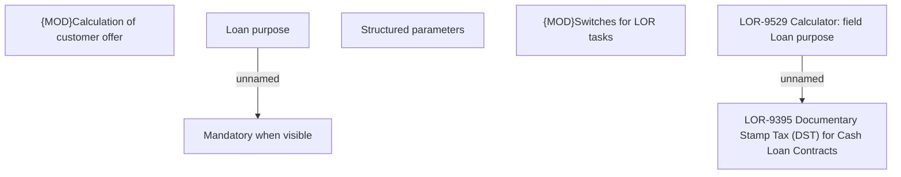

# LOR-9529 Calculator: field Loan purpose

- **Diagram Type**: Custom
- **Package**: HomerSelect/BSL/Requirements Model/Finished/LOR/LOR-9395 Documentary Stamp Tax (DST) for Cash Loan Contracts/LOR-9529 Calculator: field Loan purpose
- **Diagram ID**: 153113
- **Elements**: 7
- **Connectors**: 2

