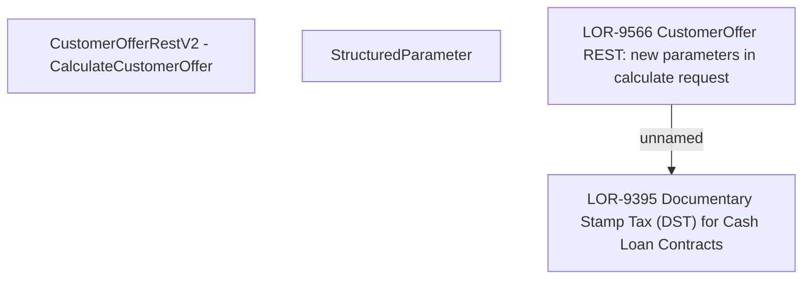

# LOR-9566 CustomerOffer REST: new parameters in calculate request

```mermaid
graph TD
    CustomerOfferRestV2_CalculateCustomerOffer["CustomerOfferRestV2 - CalculateCustomerOffer"]
    StructuredParameter["StructuredParameter"]
    LOR_9566_CustomerOffer_REST_new_parameters_in_calculate_requ["LOR-9566 CustomerOffer REST: new parameters in calculate request"]
    LOR_9395_Documentary_Stamp_Tax_DST_for_Cash_Loan_Contracts["LOR-9395 Documentary Stamp Tax (DST) for Cash Loan Contracts"]
    LOR_9566_CustomerOffer_REST_new_parameters_in_calculate_requ -->|unnamed| LOR_9395_Documentary_Stamp_Tax_DST_for_Cash_Loan_Contracts
```
