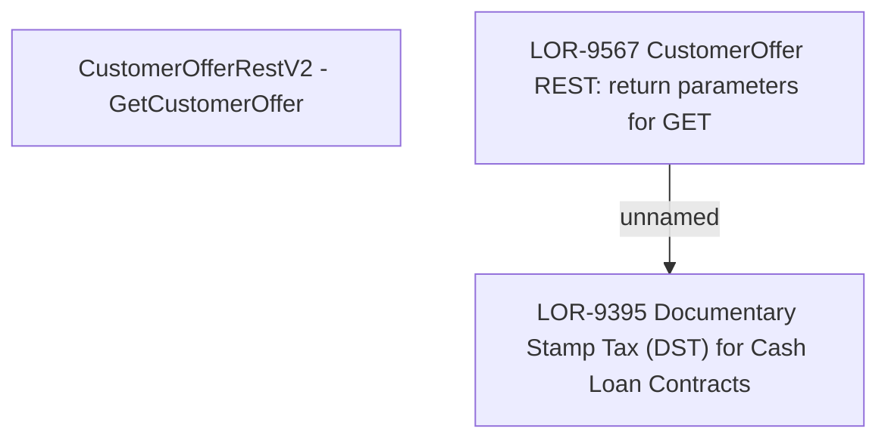

# LOR-9567 CustomerOffer REST: return parameters for GET

```mermaid
graph TD
    CustomerOfferRestV2_GetCustomerOffer["CustomerOfferRestV2 - GetCustomerOffer"]
    LOR_9567_CustomerOffer_REST_return_parameters_for_GET["LOR-9567 CustomerOffer REST: return parameters for GET"]
    LOR_9395_Documentary_Stamp_Tax_DST_for_Cash_Loan_Contracts["LOR-9395 Documentary Stamp Tax (DST) for Cash Loan Contracts"]
    LOR_9567_CustomerOffer_REST_return_parameters_for_GET -->|unnamed| LOR_9395_Documentary_Stamp_Tax_DST_for_Cash_Loan_Contracts
```
