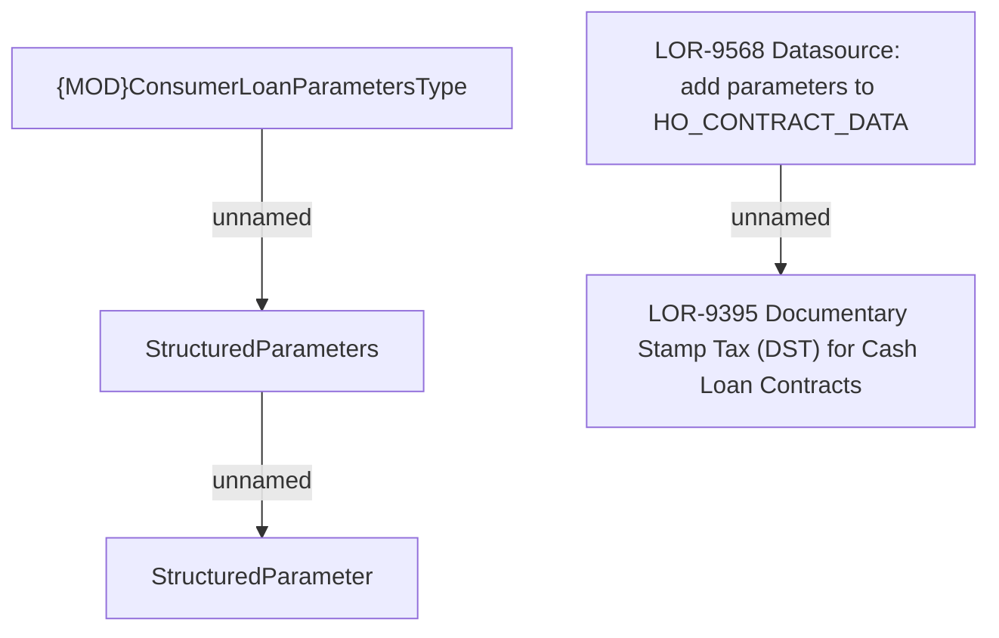

# LOR-9568 Datasource: add parameters to HO_CONTRACT_DATA

```mermaid
graph TD
    StructuredParameters["StructuredParameters"]
    StructuredParameter["StructuredParameter"]
    MOD_ConsumerLoanParametersType["{MOD}ConsumerLoanParametersType"]
    LOR_9568_Datasource_add_parameters_to_HO_CONTRACT_DATA["LOR-9568 Datasource: add parameters to HO_CONTRACT_DATA"]
    LOR_9395_Documentary_Stamp_Tax_DST_for_Cash_Loan_Contracts["LOR-9395 Documentary Stamp Tax (DST) for Cash Loan Contracts"]
    LOR_9568_Datasource_add_parameters_to_HO_CONTRACT_DATA -->|unnamed| LOR_9395_Documentary_Stamp_Tax_DST_for_Cash_Loan_Contracts
    StructuredParameters -->|unnamed| StructuredParameter
    MOD_ConsumerLoanParametersType -->|unnamed| StructuredParameters
```
