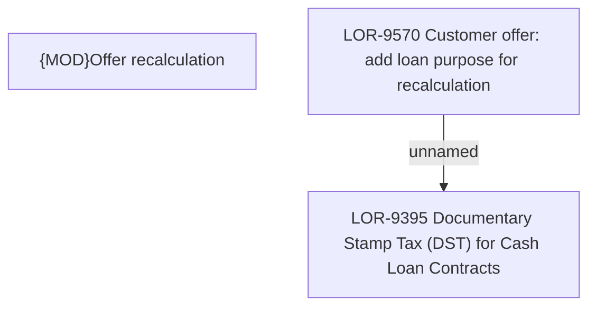

# LOR-9570 Customer offer: add loan purpose for recalculation

- **Diagram Type**: Custom
- **Package**: HomerSelect/BSL/Requirements Model/Finished/LOR/LOR-9395 Documentary Stamp Tax (DST) for Cash Loan Contracts/LOR-9570 Customer offer: add loan purpose for recalculation
- **Diagram ID**: 153117
- **Elements**: 3
- **Connectors**: 1

