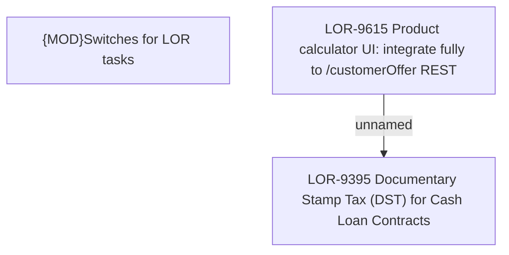

# LOR-9615 Product calculator UI: integrate fully to /customerOffer REST

- **Diagram Type**: Custom
- **Package**: HomerSelect/BSL/Requirements Model/Finished/LOR/LOR-9395 Documentary Stamp Tax (DST) for Cash Loan Contracts/LOR-9615 Product calculator UI: integrate fully to /customerOffer REST
- **Diagram ID**: 153118
- **Elements**: 3
- **Connectors**: 1

