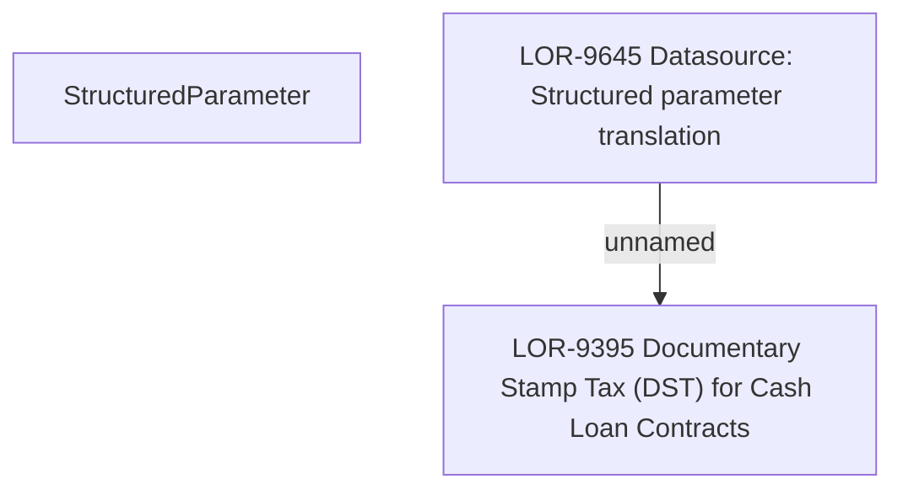

# LOR-9645 Datasource: Structured parameter translation

```mermaid
graph TD
    StructuredParameter["StructuredParameter"]
    LOR_9645_Datasource_Structured_parameter_translation["LOR-9645 Datasource: Structured parameter translation"]
    LOR_9395_Documentary_Stamp_Tax_DST_for_Cash_Loan_Contracts["LOR-9395 Documentary Stamp Tax (DST) for Cash Loan Contracts"]
    LOR_9645_Datasource_Structured_parameter_translation -->|unnamed| LOR_9395_Documentary_Stamp_Tax_DST_for_Cash_Loan_Contracts
```
