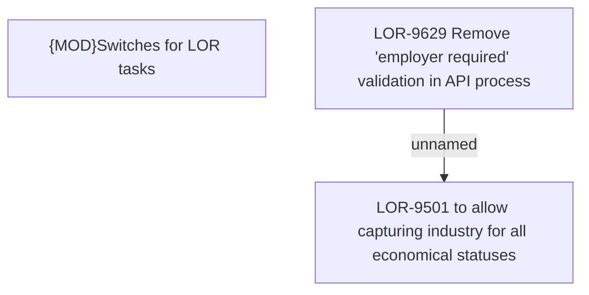

# LOR-9501 to allow capturing industry for all economical statuses

- **Diagram Type**: Custom
- **Package**: HomerSelect/BSL/Requirements Model/Finished/LOR/LOR-9501 to allow capturing industry for all economical statuses
- **Diagram ID**: 153127
- **Elements**: 3
- **Connectors**: 1

