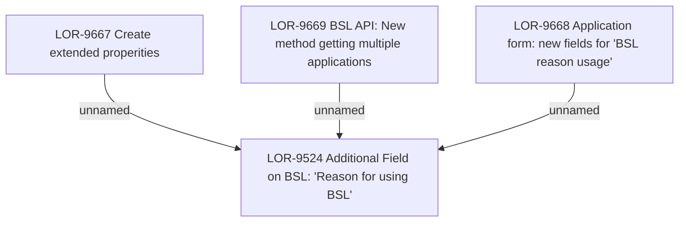

# LOR-9524 Additional Field on BSL: "Reason for using BSL"

```mermaid
graph TD
    LOR_9668_Application_form_new_fields_for_BSL_reason_usage["LOR-9668 Application form: new fields for 'BSL reason usage'"]
    LOR_9669_BSL_API_New_method_getting_multiple_applications["LOR-9669 BSL API: New method getting multiple applications"]
    LOR_9667_Create_extended_properities["LOR-9667 Create extended properities"]
    LOR_9524_Additional_Field_on_BSL_Reason_for_using_BSL["LOR-9524 Additional Field on BSL: 'Reason for using BSL'"]
    LOR_9667_Create_extended_properities -->|unnamed| LOR_9524_Additional_Field_on_BSL_Reason_for_using_BSL
    LOR_9669_BSL_API_New_method_getting_multiple_applications -->|unnamed| LOR_9524_Additional_Field_on_BSL_Reason_for_using_BSL
    LOR_9668_Application_form_new_fields_for_BSL_reason_usage -->|unnamed| LOR_9524_Additional_Field_on_BSL_Reason_for_using_BSL
```
