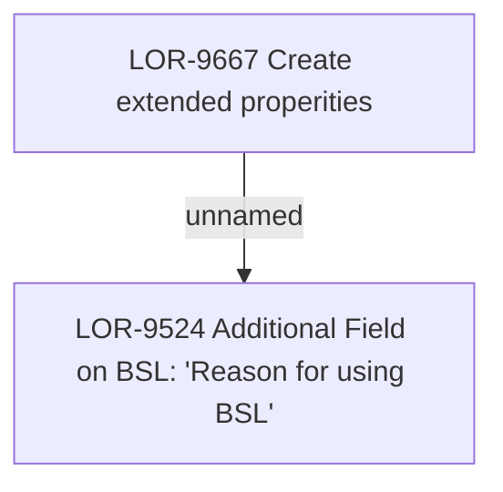

# LOR-9667 Create extended properties

```mermaid
graph TD
    LOR_9524_Additional_Field_on_BSL_Reason_for_using_BSL["LOR-9524 Additional Field on BSL: 'Reason for using BSL'"]
    LOR_9667_Create_extended_properities["LOR-9667 Create extended properities"]
    LOR_9667_Create_extended_properities -->|unnamed| LOR_9524_Additional_Field_on_BSL_Reason_for_using_BSL
```
