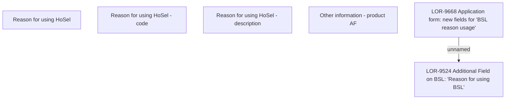

# LOR-9668 Application form: new fields for "BSL reason usage"

- **Diagram Type**: Custom
- **Package**: HomerSelect/BSL/Requirements Model/Finished/LOR/LOR-9524 Additional Field on BSL: "Reason for using BSL"/LOR-9668 Application form: new fields for "BSL reason usage"
- **Diagram ID**: 153701
- **Elements**: 6
- **Connectors**: 1

