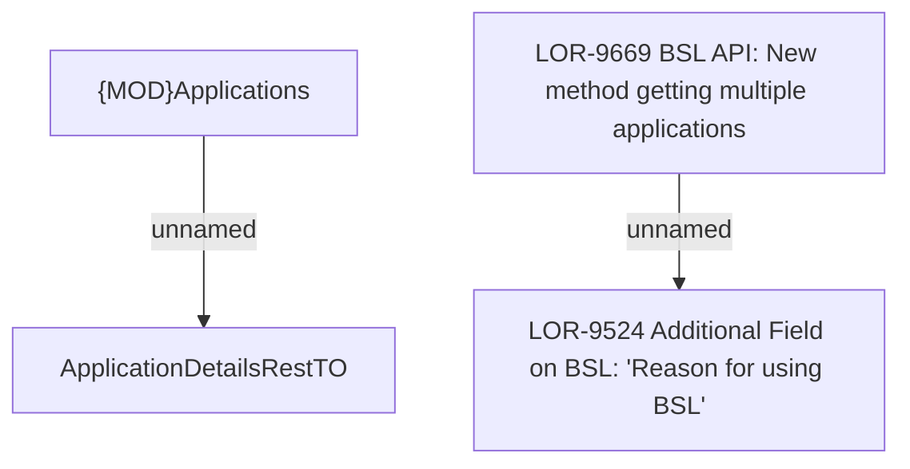

# LOR-9669 BSL API: New method getting multiple applications

- **Diagram Type**: Custom
- **Package**: HomerSelect/BSL/Requirements Model/Finished/LOR/LOR-9524 Additional Field on BSL: "Reason for using BSL"/LOR-9669 BSL API: New method getting multiple applications
- **Diagram ID**: 153702
- **Elements**: 4
- **Connectors**: 2

