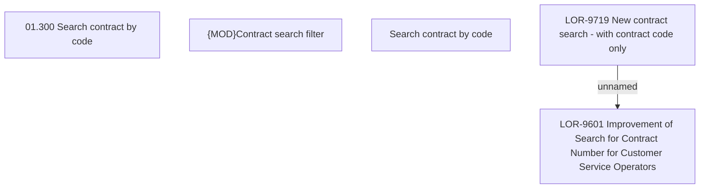

# LOR-9601 Improvement of Search for Contract Number for Customer Service Operators 

- **Diagram Type**: Custom
- **Package**: HomerSelect/BSL/Requirements Model/Finished/LOR/LOR-9601 Improvement of Search for Contract Number for Customer Service Operators 
- **Diagram ID**: 153836
- **Elements**: 5
- **Connectors**: 1

