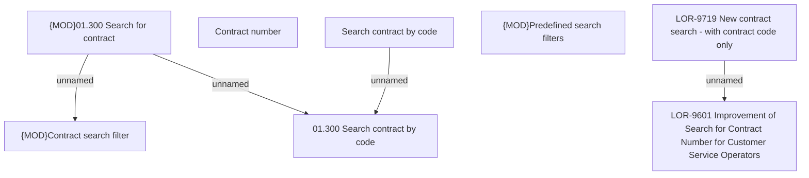

# LOR-9719 New contract search - with contract code only

- **Diagram Type**: Custom
- **Package**: HomerSelect/BSL/Requirements Model/Finished/LOR/LOR-9601 Improvement of Search for Contract Number for Customer Service Operators /LOR-9719 New contract search - with contract code only
- **Diagram ID**: 153837
- **Elements**: 10
- **Connectors**: 4

