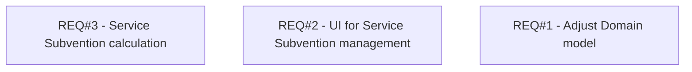

# PCG-1007 Service Subventions (CBL-2923)

```mermaid
graph TD
    REQ_3_Service_Subvention_calculation["REQ#3 - Service Subvention calculation"]
    REQ_2_UI_for_Service_Subvention_management["REQ#2 - UI for Service Subvention management"]
    REQ_1_Adjust_Domain_model["REQ#1 - Adjust Domain model"]
```
