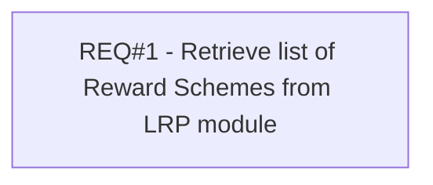

# PCG-134 List of LRP schemes (CBL-100)

- **Diagram Type**: Custom
- **Package**: HomerSelect/BSL/Requirements Model/Finished/PCG/PCG-134 List of LRP schemes (CBL-100)
- **Diagram ID**: 103176
- **Elements**: 1
- **Connectors**: 0

