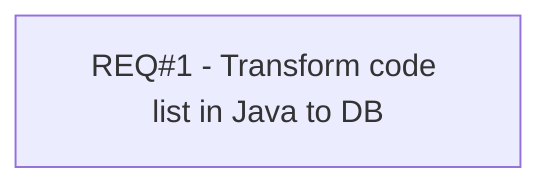

# PCG-140 Revise storage for code-lists

- **Diagram Type**: Custom
- **Package**: HomerSelect/BSL/Requirements Model/Finished/PCG/PCG-140 Revise storage for code-lists
- **Diagram ID**: 103177
- **Elements**: 1
- **Connectors**: 0

