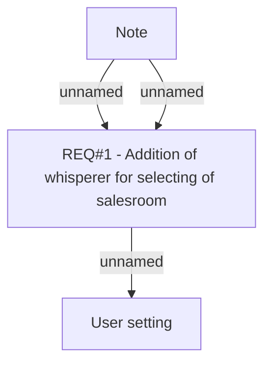

# PCG-157 Speed up selecting of Active salesroom in BSL (CBL-43)

- **Diagram Type**: Custom
- **Package**: HomerSelect/BSL/Requirements Model/Finished/PCG/PCG-157 Speed up selecting of Active salesroom in BSL (CBL-43)
- **Diagram ID**: 103144
- **Elements**: 3
- **Connectors**: 3

