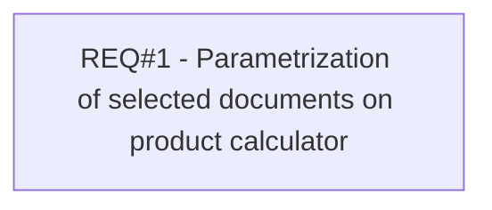

# PCG-164 Product Calculator - Default Document Types (CBL-126)

- **Diagram Type**: Custom
- **Package**: HomerSelect/BSL/Requirements Model/Finished/PCG/PCG-164 Product Calculator - Default Document Types (CBL-126)
- **Diagram ID**: 103181
- **Elements**: 1
- **Connectors**: 0

