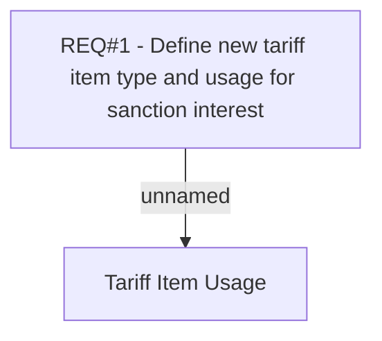

# PCG-196 Interest rate of the overdue principal debt (CBL-40)

```mermaid
graph TD
    Tariff_Item_Usage["Tariff Item Usage"]
    REQ_1_Define_new_tariff_item_type_and_usage_for_sanction_int["REQ#1 - Define new tariff item type and usage for sanction interest"]
    REQ_1_Define_new_tariff_item_type_and_usage_for_sanction_int -->|unnamed| Tariff_Item_Usage
```
