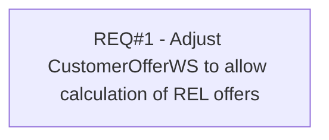

# PCG-218 Calculatïon of Customer Offer for RELs

- **Diagram Type**: Custom
- **Package**: HomerSelect/BSL/Requirements Model/Finished/PCG/PCG-218 Calculatïon of Customer Offer for RELs (CBL-122)
- **Diagram ID**: 103154
- **Elements**: 1
- **Connectors**: 0

