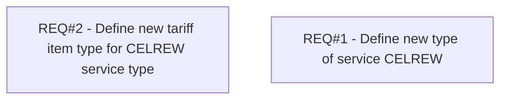

# PCG-221 CEL Rewards (CBL-109)

- **Diagram Type**: Custom
- **Package**: HomerSelect/BSL/Requirements Model/Finished/PCG/PCG-221 CEL Rewards (CBL-109)
- **Diagram ID**: 103327
- **Elements**: 2
- **Connectors**: 0

