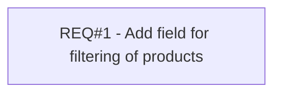

# PCG-231 Filter products for an assignment to salesroom

- **Diagram Type**: Custom
- **Package**: HomerSelect/BSL/Requirements Model/Finished/PCG/PCG-231 Filter products for an assignment to salesroom
- **Diagram ID**: 103186
- **Elements**: 1
- **Connectors**: 0

