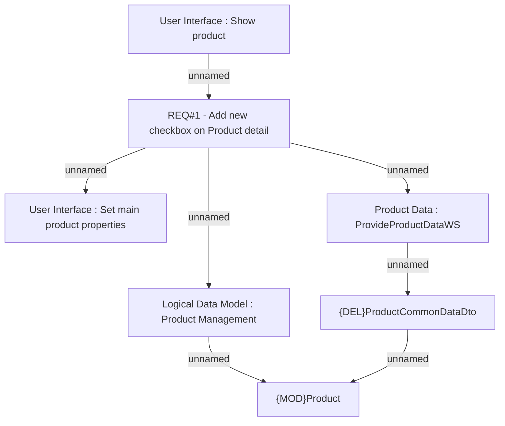

# PCG-240 PSL integration with BSL (CBL-159)

```mermaid
graph TD
    User_Interface_Set_main_product_properties["User Interface : Set main product properties"]
    User_Interface_Show_product["User Interface : Show product"]
    Product_Data_ProvideProductDataWS["Product Data : ProvideProductDataWS"]
    Logical_Data_Model_Product_Management["Logical Data Model : Product Management"]
    MOD_Product["{MOD}Product"]
    DEL_ProductCommonDataDto["{DEL}ProductCommonDataDto"]
    REQ_1_Add_new_checkbox_on_Product_detail["REQ#1 - Add new checkbox on Product detail"]
    REQ_1_Add_new_checkbox_on_Product_detail -->|unnamed| Logical_Data_Model_Product_Management
    REQ_1_Add_new_checkbox_on_Product_detail -->|unnamed| User_Interface_Set_main_product_properties
    REQ_1_Add_new_checkbox_on_Product_detail -->|unnamed| Product_Data_ProvideProductDataWS
    Logical_Data_Model_Product_Management -->|unnamed| MOD_Product
    Product_Data_ProvideProductDataWS -->|unnamed| DEL_ProductCommonDataDto
    User_Interface_Show_product -->|unnamed| REQ_1_Add_new_checkbox_on_Product_detail
    DEL_ProductCommonDataDto -->|unnamed| MOD_Product
```
