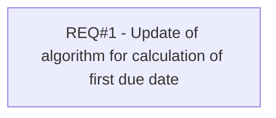

# PCG-262 First due date after 14 days (CBL-269)

- **Diagram Type**: Custom
- **Package**: HomerSelect/BSL/Requirements Model/Finished/PCG/PCG-262 First due date after 14 days (CBL-269)
- **Diagram ID**: 103161
- **Elements**: 1
- **Connectors**: 0

