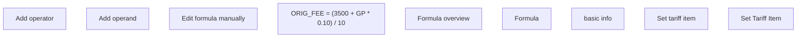

# GUI

- **Diagram Type**: Custom
- **Package**: HomerSelect/BSL/Requirements Model/Finished/PCG/PCG-2680 Tariff configuration (CBL-11489)
- **Diagram ID**: 138390
- **Elements**: 9
- **Connectors**: 0

