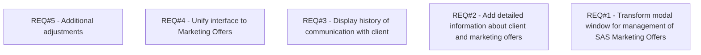

# PCG-288 Marketing offer form in BSL (CBL-149)

- **Diagram Type**: Custom
- **Package**: HomerSelect/BSL/Requirements Model/Finished/PCG/PCG-288 Marketing offer form in BSL (CBL-149)
- **Diagram ID**: 103255
- **Elements**: 5
- **Connectors**: 0

