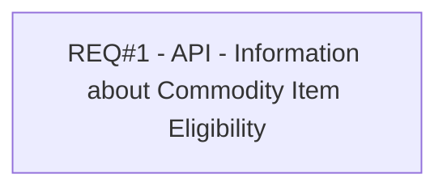

# PCG-290 API - Information about Commodity Item Eligibility (CBL-238)

- **Diagram Type**: Custom
- **Package**: HomerSelect/BSL/Requirements Model/Finished/PCG/PCG-290 API - Information about Commodity Item Eligibility (CBL-238)
- **Diagram ID**: 103183
- **Elements**: 1
- **Connectors**: 0

