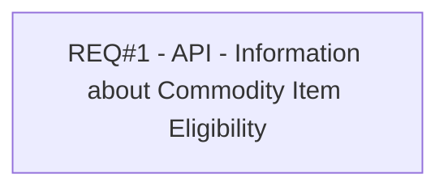

# PCG-290 API - Information about Commodity Item Eligibility (CBL-238)

```mermaid
graph TD
    REQ_1_API_Information_about_Commodity_Item_Eligibility["REQ#1 - API - Information about Commodity Item Eligibility"]
```
