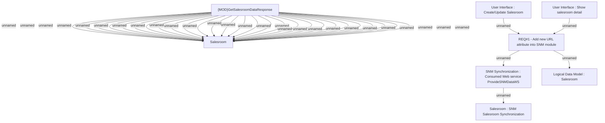

# PCG-291 Merchant URL address in Salesroom Management (CBL-262)

```mermaid
graph TD
    Salesroom["Salesroom"]
    MOD_GetSalesroomDataResponse["{MOD}GetSalesroomDataResponse"]
    Salesroom_SNM_Salesroom_Synchronization["Salesroom : SNM Salesroom Synchronization"]
    SNM_Synchronization_Consumed_Web_service_ProvideSNMDataWS["SNM Synchronization : Consumed Web service ProvideSNMDataWS"]
    Logical_Data_Model_Salesroom["Logical Data Model : Salesroom"]
    User_Interface_Show_salesroom_detail["User Interface : Show salesroom detail"]
    User_Interface_Create_Update_Salesroom["User Interface : Create/Update Salesroom"]
    REQ_1_Add_new_URL_attribute_into_SNM_module["REQ#1 - Add new URL attribute into SNM module "]
    REQ_1_Add_new_URL_attribute_into_SNM_module -->|unnamed| SNM_Synchronization_Consumed_Web_service_ProvideSNMDataWS
    REQ_1_Add_new_URL_attribute_into_SNM_module -->|unnamed| Logical_Data_Model_Salesroom
    User_Interface_Create_Update_Salesroom -->|unnamed| REQ_1_Add_new_URL_attribute_into_SNM_module
    User_Interface_Show_salesroom_detail -->|unnamed| REQ_1_Add_new_URL_attribute_into_SNM_module
    SNM_Synchronization_Consumed_Web_service_ProvideSNMDataWS -->|unnamed| Salesroom_SNM_Salesroom_Synchronization
    MOD_GetSalesroomDataResponse -->|unnamed| Salesroom
    MOD_GetSalesroomDataResponse -->|unnamed| Salesroom
    MOD_GetSalesroomDataResponse -->|unnamed| Salesroom
    MOD_GetSalesroomDataResponse -->|unnamed| Salesroom
    MOD_GetSalesroomDataResponse -->|unnamed| Salesroom
    MOD_GetSalesroomDataResponse -->|unnamed| Salesroom
    MOD_GetSalesroomDataResponse -->|unnamed| Salesroom
    MOD_GetSalesroomDataResponse -->|unnamed| Salesroom
    MOD_GetSalesroomDataResponse -->|unnamed| Salesroom
    MOD_GetSalesroomDataResponse -->|unnamed| Salesroom
    MOD_GetSalesroomDataResponse -->|unnamed| Salesroom
    MOD_GetSalesroomDataResponse -->|unnamed| Salesroom
    MOD_GetSalesroomDataResponse -->|unnamed| Salesroom
    MOD_GetSalesroomDataResponse -->|unnamed| Salesroom
    MOD_GetSalesroomDataResponse -->|unnamed| Salesroom
    MOD_GetSalesroomDataResponse -->|unnamed| Salesroom
    MOD_GetSalesroomDataResponse -->|unnamed| Salesroom
    MOD_GetSalesroomDataResponse -->|unnamed| Salesroom
    MOD_GetSalesroomDataResponse -->|unnamed| Salesroom
    MOD_GetSalesroomDataResponse -->|unnamed| Salesroom
    MOD_GetSalesroomDataResponse -->|unnamed| Salesroom
    MOD_GetSalesroomDataResponse -->|unnamed| Salesroom
    MOD_GetSalesroomDataResponse -->|unnamed| Salesroom
    MOD_GetSalesroomDataResponse -->|unnamed| Salesroom
    MOD_GetSalesroomDataResponse -->|unnamed| Salesroom
    MOD_GetSalesroomDataResponse -->|unnamed| Salesroom
    MOD_GetSalesroomDataResponse -->|unnamed| Salesroom
```
