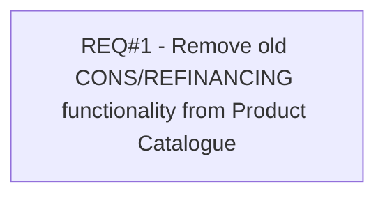

# PCG-308 Remove old CONS/REFINANCING functionality

- **Diagram Type**: Custom
- **Package**: HomerSelect/BSL/Requirements Model/Finished/PCG/PCG-308 Remove old CONS/REFINANCING functionality
- **Diagram ID**: 103185
- **Elements**: 1
- **Connectors**: 0

