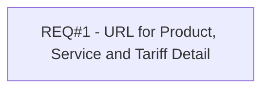

# PCG-328 URL for Product, Service and Tariff Detail

- **Diagram Type**: Custom
- **Package**: HomerSelect/BSL/Requirements Model/Finished/PCG/PCG-328 URL for Product, Service and Tariff Detail
- **Diagram ID**: 103191
- **Elements**: 1
- **Connectors**: 0

