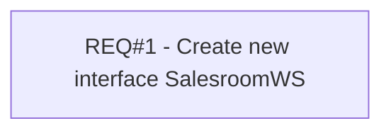

# PCG-333 SAP: Shift Planning to POS Assignment (CBL-279)

- **Diagram Type**: Custom
- **Package**: HomerSelect/BSL/Requirements Model/Finished/PCG/PCG-333 SAP: Shift Planning to POS Assignment (CBL-279)
- **Diagram ID**: 103212
- **Elements**: 1
- **Connectors**: 0

