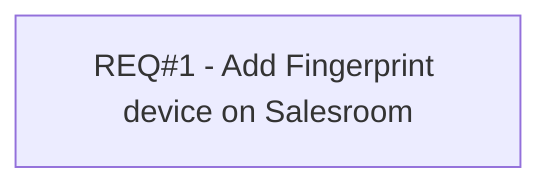

# PCG-398 SNM - Add e-KTP Reader parameters (CBL-361)

- **Diagram Type**: Custom
- **Package**: HomerSelect/BSL/Requirements Model/Finished/PCG/PCG-398 SNM - Add e-KTP Reader parameters (CBL-361)
- **Diagram ID**: 103230
- **Elements**: 1
- **Connectors**: 0

