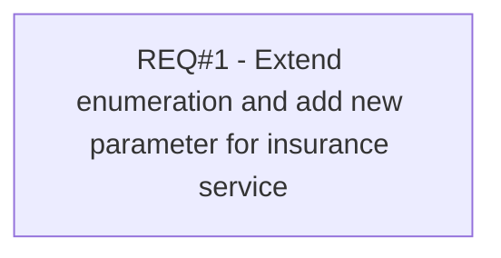

# PCG-418 Set maximum length of insurance service (CBL-415)

- **Diagram Type**: Custom
- **Package**: HomerSelect/BSL/Requirements Model/Finished/PCG/PCG-418 Set maximum length of insurance service (CBL-415)
- **Diagram ID**: 103231
- **Elements**: 1
- **Connectors**: 0

