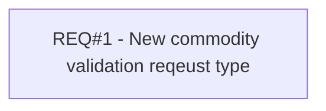

# PCG-470 IMEI validation requested but not mandatory for signing process (CBL-843)

- **Diagram Type**: Custom
- **Package**: HomerSelect/BSL/Requirements Model/Finished/PCG/PCG-470 IMEI validation requested but not mandatory for signing process (CBL-843)
- **Diagram ID**: 103332
- **Elements**: 1
- **Connectors**: 0

