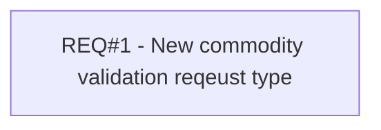

# PCG-470 IMEI validation requested but not mandatory for signing process (CBL-843)

```mermaid
graph TD
    REQ_1_New_commodity_validation_reqeust_type["REQ#1 - New commodity validation reqeust type"]
```
