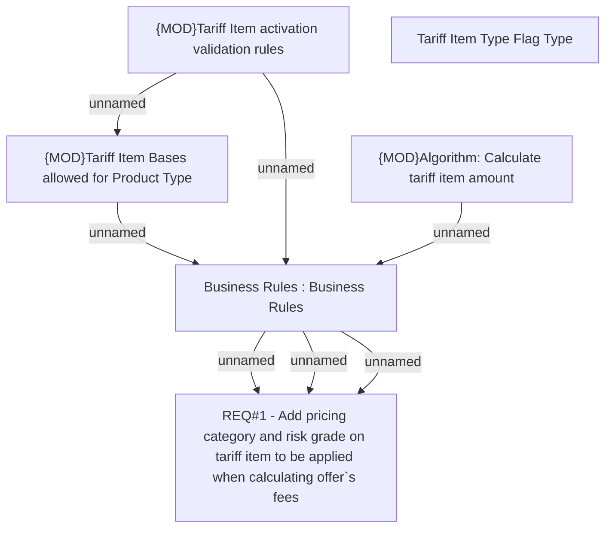

# PCG-5010 New Limit Value Base Type and Limit Value for POS Tariff

- **Diagram Type**: Custom
- **Package**: HomerSelect/BSL/Requirements Model/Finished/PCG/PCG-5010 (PH) New Limit Value Base Type and Limit Value for POS Tariff
- **Diagram ID**: 161017
- **Elements**: 8
- **Connectors**: 7

