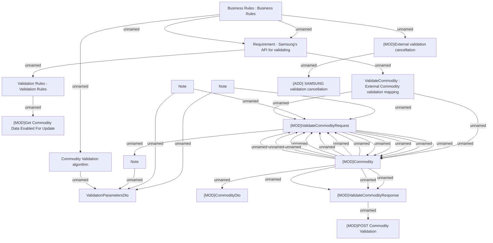

# PCG-5108 -SAMSUNG - HA validation Integration - Hosel origination

```mermaid
graph TD
    el_1844086["Note"]
    el_1844085["Note"]
    el_1844087["Note"]
    MOD_Get_Commodity_Data_Enabled_For_Update["{MOD}Get Commodity Data Enabled For Update"]
    Validation_Rules_Validation_Rules["Validation Rules : Validation Rules"]
    ValidationParametersDto["ValidationParametersDto"]
    MOD_CommodityDto["{MOD}CommodityDto"]
    MOD_POST_Commodity_Validation["{MOD}POST Commodity Validation"]
    MOD_ValidateCommodityResponse["{MOD}ValidateCommodityResponse"]
    MOD_Commodity["{MOD}Commodity"]
    MOD_ValidateCommodityRequest["{MOD}ValidateCommodityRequest"]
    ValidateCommodity_External_Commodity_validation_mapping["ValidateCommodity : External Commodity validation mapping"]
    Commodity_Validation_algorithm["Commodity Validation algorithm"]
    Business_Rules_Business_Rules["Business Rules : Business Rules"]
    ADD_SAMSUNG_validation_cancellation["{ADD} SAMSUNG validation cancellation"]
    MOD_External_validation_cancellation["{MOD}External validation cancellation"]
    Business_Rules_Business_Rules["Business Rules : Business Rules"]
    Requirement_Samsung_s_API_for_validating["Requirement - Samsung's API for validating"]
    el_1844086 -->|unnamed| MOD_ValidateCommodityRequest
    Business_Rules_Business_Rules -->|unnamed| Requirement_Samsung_s_API_for_validating
    Validation_Rules_Validation_Rules -->|unnamed| MOD_Get_Commodity_Data_Enabled_For_Update
    Requirement_Samsung_s_API_for_validating -->|unnamed| Validation_Rules_Validation_Rules
    el_1844086 -->|unnamed| ValidationParametersDto
    el_1844087 -->|unnamed| ValidationParametersDto
    el_1844085 -->|unnamed| ValidationParametersDto
    el_1844087 -->|unnamed| MOD_ValidateCommodityRequest
    Business_Rules_Business_Rules -->|unnamed| Requirement_Samsung_s_API_for_validating
    Business_Rules_Business_Rules -->|unnamed| MOD_External_validation_cancellation
    Business_Rules_Business_Rules -->|unnamed| Commodity_Validation_algorithm
    Requirement_Samsung_s_API_for_validating -->|unnamed| ValidateCommodity_External_Commodity_validation_mapping
    ValidateCommodity_External_Commodity_validation_mapping -->|unnamed| MOD_Commodity
    ValidateCommodity_External_Commodity_validation_mapping -->|unnamed| MOD_ValidateCommodityRequest
    MOD_Commodity -->|unnamed| MOD_ValidateCommodityResponse
    MOD_Commodity -->|unnamed| MOD_ValidateCommodityRequest
    MOD_Commodity -->|unnamed| MOD_ValidateCommodityRequest
    MOD_Commodity -->|unnamed| MOD_ValidateCommodityRequest
    MOD_Commodity -->|unnamed| MOD_ValidateCommodityResponse
    MOD_Commodity -->|unnamed| MOD_ValidateCommodityResponse
    MOD_Commodity -->|unnamed| MOD_ValidateCommodityRequest
    MOD_Commodity -->|unnamed| MOD_ValidateCommodityRequest
    MOD_Commodity -->|unnamed| MOD_ValidateCommodityRequest
    MOD_Commodity -->|unnamed| MOD_CommodityDto
    MOD_Commodity -->|unnamed| MOD_ValidateCommodityRequest
    Commodity_Validation_algorithm -->|unnamed| ValidationParametersDto
    MOD_External_validation_cancellation -->|unnamed| ADD_SAMSUNG_validation_cancellation
    MOD_ValidateCommodityResponse -->|unnamed| MOD_POST_Commodity_Validation
    MOD_ValidateCommodityRequest -->|unnamed| MOD_Commodity
    MOD_ValidateCommodityRequest -->|unnamed| MOD_Commodity
    MOD_ValidateCommodityRequest -->|unnamed| MOD_Commodity
    MOD_ValidateCommodityRequest -->|unnamed| MOD_Commodity
    MOD_ValidateCommodityRequest -->|unnamed| MOD_Commodity
    MOD_ValidateCommodityRequest -->|unnamed| el_1844085
```
