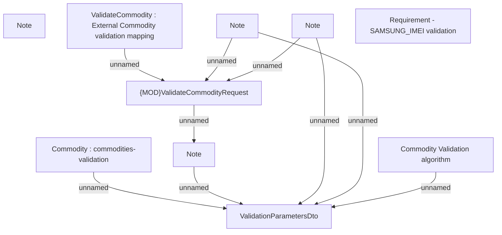

# PCG-5109 - Samsung - Updated API for IMEI validation

- **Diagram Type**: Custom
- **Package**: HomerSelect/BSL/Requirements Model/Finished/PCG/PCG-5109 - SAMSUNG - Updated API - IMEI validation (CBL-27815)
- **Diagram ID**: 160910
- **Elements**: 10
- **Connectors**: 9

