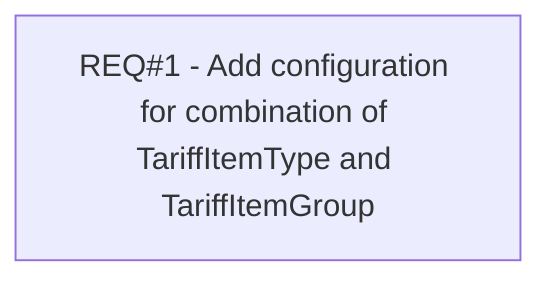

# PCG-513 SMS alerts opt in/out (CBL-21)

- **Diagram Type**: Custom
- **Package**: HomerSelect/BSL/Requirements Model/Finished/PCG/PCG-513 SMS alerts opt in/out (CBL-21)
- **Diagram ID**: 103334
- **Elements**: 1
- **Connectors**: 0

