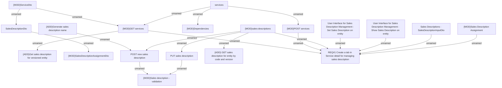

# One Level Requirement Hierarchy

```mermaid
graph TD
    User_Interface_for_Sales_Description_Management_Show_Sales_D["User Interface for Sales Description Management : Show Sales Description on entity"]
    User_Interface_for_Sales_Description_Management_Set_Sales_De["User Interface for Sales Description Management : Set Sales Description on entity"]
    MOD_POST_services["{MOD}POST services"]
    ADD_Get_sales_description_for_versioned_entity["{ADD}Get sales description for versioned entity"]
    MOD_Dependencies["{MOD}Dependencies"]
    services["services"]
    MOD_GET_services["{MOD}GET services"]
    MOD_SalesDescriptionAssignmentDto["{MOD}SalesDescriptionAssignmentDto"]
    SalesDescriptionDto["SalesDescriptionDto"]
    MOD_ServiceDto["{MOD}ServiceDto"]
    MOD_Sales_Description_Assignment["{MOD}Sales Description Assignment"]
    ADD_Generate_sales_description_name["{ADD}Generate sales description name"]
    PUT_sales_description["PUT sales description"]
    POST_new_sales_description["POST new sales description"]
    ADD_GET_sales_description_for_entity_by_code_and_version["{ADD} GET sales description for entity by code and version"]
    MOD_sales_descriptions["{MOD}sales-descriptions"]
    Sales_Descriptions_SalesDescriptionInputDto["Sales Descriptions : SalesDescriptionInputDto"]
    REQ_1_Create_a_tab_in_Service_detail_for_managing_sales_desc["REQ#1 Create a tab in Service detail for managing sales description"]
    MOD_Sales_description_validation["{MOD}Sales description - validation"]
    MOD_sales_descriptions -->|unnamed| ADD_GET_sales_description_for_entity_by_code_and_version
    SalesDescriptionDto -->|unnamed| MOD_SalesDescriptionAssignmentDto
    MOD_sales_descriptions -->|unnamed| PUT_sales_description
    MOD_sales_descriptions -->|unnamed| POST_new_sales_description
    PUT_sales_description -->|unnamed| MOD_Sales_description_validation
    MOD_Sales_Description_Assignment -->|unnamed| REQ_1_Create_a_tab_in_Service_detail_for_managing_sales_desc
    Sales_Descriptions_SalesDescriptionInputDto -->|unnamed| REQ_1_Create_a_tab_in_Service_detail_for_managing_sales_desc
    User_Interface_for_Sales_Description_Management_Show_Sales_D -->|unnamed| REQ_1_Create_a_tab_in_Service_detail_for_managing_sales_desc
    User_Interface_for_Sales_Description_Management_Set_Sales_De -->|unnamed| REQ_1_Create_a_tab_in_Service_detail_for_managing_sales_desc
    MOD_sales_descriptions -->|unnamed| REQ_1_Create_a_tab_in_Service_detail_for_managing_sales_desc
    POST_new_sales_description -->|unnamed| MOD_Sales_description_validation
    ADD_Generate_sales_description_name -->|unnamed| POST_new_sales_description
    MOD_POST_services -->|unnamed| REQ_1_Create_a_tab_in_Service_detail_for_managing_sales_desc
    MOD_GET_services -->|unnamed| ADD_Get_sales_description_for_versioned_entity
    MOD_GET_services -->|unnamed| REQ_1_Create_a_tab_in_Service_detail_for_managing_sales_desc
    services -->|unnamed| MOD_Dependencies
    services -->|unnamed| MOD_POST_services
    services -->|unnamed| MOD_GET_services
    MOD_ServiceDto -->|unnamed| SalesDescriptionDto
    MOD_ServiceDto -->|unnamed| MOD_GET_services
```
