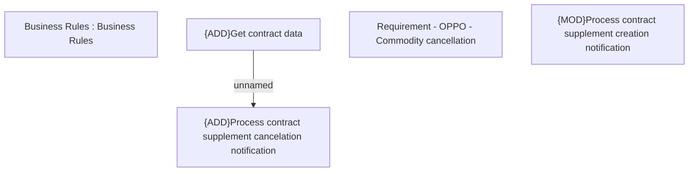

# PCG-5309 OPPO - IMEI unblocking API (CBL-28662)

- **Diagram Type**: Custom
- **Package**: HomerSelect/BSL/Requirements Model/Finished/PCG/PCG-5309 OPPO - IMEI unblocking API (CBL-28662)
- **Diagram ID**: 162153
- **Elements**: 5
- **Connectors**: 1

