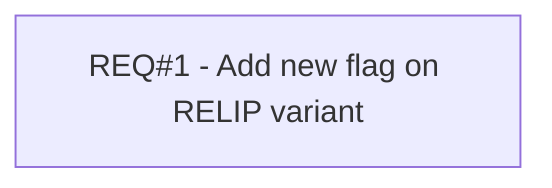

# PCG-570 Choose Your Reward (CBL-1001)

- **Diagram Type**: Custom
- **Package**: HomerSelect/BSL/Requirements Model/Finished/PCG/PCG-570 Choose Your Reward (CBL-1001)
- **Diagram ID**: 103321
- **Elements**: 1
- **Connectors**: 0

