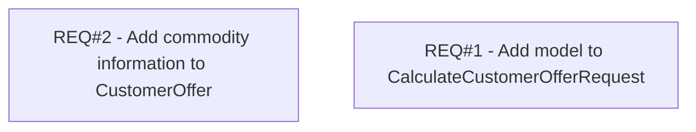

# PCG-572 IN Paperless - REQ2 - Allow calculate offer via WS with definition of Model (CBL-1134)

- **Diagram Type**: Custom
- **Package**: HomerSelect/BSL/Requirements Model/Finished/PCG/PCG-572 IN Paperless - REQ2 - Allow calculate offer via WS with definition of Model (CBL-1134)
- **Diagram ID**: 103343
- **Elements**: 2
- **Connectors**: 0

